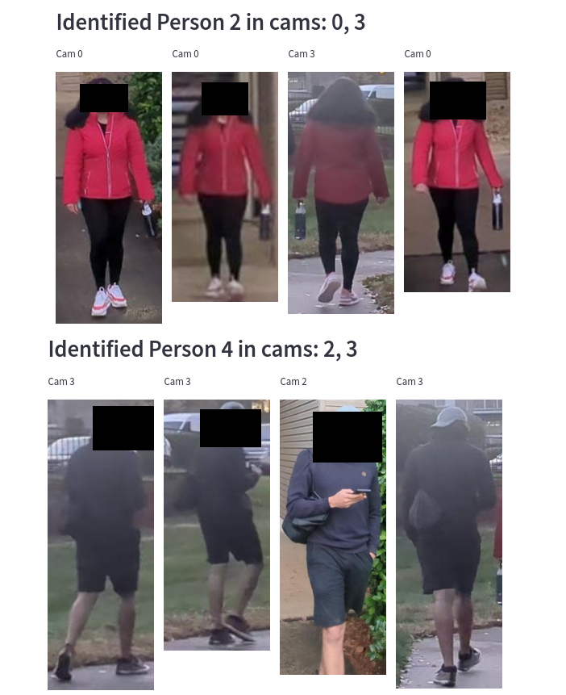

# Suspicious person tracking across multiple cameras

This project aims to track people across multiple surveillence cameras.
You can select your source of videos spanning across multiple cameras and use the model to extract the different people that appear in them.



### Results on Market1501 dataset

| Model and method | mAP | R@1 | R@5 | R@10 | R@20 |
|----------|----------|----------|----------|----------|----------|
| Resnet50 with Proxy Anchor loss | 79% | 92% | 97% | 98% | 99% |
| Resnet50 classic method | 68% | 85% | 93% | 95% | 97% |
| OSNet with Proxy Anchor loss | 62% | 83% | 93% | 96% | 98% |
| OSNet classic method | 73% | 90% | 96% | 97% | 98% |


### Setting up - Docker method (Preferred)

1) Install Docker.
2) Clone this repository.
3) Open a terminal in the cloned directory.
4) Copy the videos you want to analyze in the data directory in the project root.
5) Run the docker command: ```docker-compose build``` to build all the containers.
6) Run the docker command: ```docker-compose up``` to run the containers.
7) Open the link http://localhost:8501 to launch the app.

### Training notebooks guide

Before you proceed with the notebooks, make sure you follow the steps below: 

1) ```pip install -r requirements.txt```
2) Download the (Market1501)[http://zheng-lab.cecs.anu.edu.au/Project/project_reid.html] dataset.

All the notebooks except the train_classic uses Proxy Anchor Loss metric learning for training.

- ```Person extractor-Video.ipynb``` - contains the modules used in extracting people from videos and their features.
- ```train_market_OSNET.ipynb``` - train osnet with a hold out validation.
- ```train_market_resnet.ipynb``` - train Resnet with a hold out validation.
- ```train_market_resnet-xylinx_dataloader.ipynb``` - Train and validate resnet using the standard way of evaluation.
- ```train_classic``` - Trains network using the classic architecture as a classification problem.

### Repos referenced

- [Proxy-Anchor-CVPR2020](https://github.com/tjddus9597/Proxy-Anchor-CVPR2020)
- [KaiyangZhou/deep-person-reid](https://github.com/KaiyangZhou/deep-person-reid/)
- [apple/ml-autofocusformer](https://github.com/apple/ml-autofocusformer)
- [Xilinx module for training and evaluation Market1501 dataset](https://www.xilinx.com/bin/public/openDownload?filename=pt_personreid-res50_market1501_256_128_5.3G_1.1_Z4.0.zip)